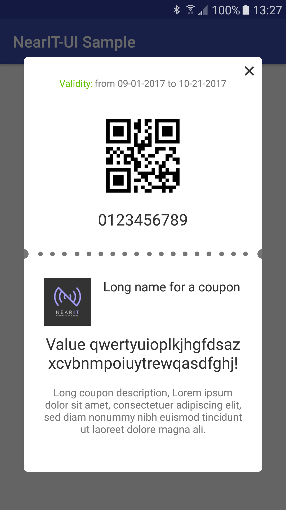

# NearIT-UI for Android
NearIT-UI is an open-source library that provides customizable UI bindings on top of the core [NearIT SDK](https://github.com/nearit/Android-SDK).
This library aims to minimize the efforts to create the UI for NearIT contents and dialogs.

For example, using NearIT-UI, a developer can launch a dialog to request location/bluetooth permissions to the user by writing a few lines of code.

#### Upcoming features
- Feedback dialog
- Coupon detail
- Coupons list
- Heads up notifications
- Missing permissions alert snackbar

## Configuration
Add the NearIT-UI library dependency. If your project uses Gradle build system, add the following dependency to `build.gradle` of your app:

```groovy
 dependencies {
    //  ...
    compile 'it.nearit.sdk:nearit-ui:1.0.1'
 }
```

**Important**: NearIT-UI will only work with NearIT SDK version 2.2.0 or higher.

## NearIt-UI for permissions request
If your app integrates NearIT services, you surely want your user to grant your app location permissions. NearIT supports the use of Beacon technology, so bluetooth could also be a requirement for your app.

#### Basic example
If you want your app to ask user for both location and bluetooth permissions (and turning both on), use the following code:

```java
 // You can choose an arbitrary request code
 private static final int NEAR_PERMISSION_REQUEST = 1000;
 
 // ...
 
 startActivityForResult(
        NearITUIBindings.getInstance(YourActivity.this)
                .createPermissionRequestIntentBuilder()
                .build(),
        NEAR_PERMISSION_REQUEST);
```

In this basic example, both location and bluetooth are required to be granted and turned on: you can check if the request succeded or failed in `onActivityResult(...)` by referring to the same request code.


#### Advanced examples
You can define the permissions request behaviour via our builder.

If your app does not use Beacons technology, you should not ask your user to turn Bluetooth on. You can achieve this with the `noBeacon()` method.

```java
 startActivityForResult(
        NearITUIBindings.getInstance(YourActivity.this)
                .createPermissionRequestIntentBuilder()
                .noBeacon()
                .build(),
        NEAR_PERMISSION_REQUEST);
```

If your app uses Beacons, but you consider the bluetooth a non-blocking requirement, just use `nonBlockingBeacon()` method

```java
 startActivityForResult(
        NearITUIBindings.getInstance(YourActivity.this)
                .createPermissionRequestIntentBuilder()
                .nonBlockingBeacon()
                .build(),
        NEAR_PERMISSION_REQUEST);
```

**Note**: Please, keep in mind that calling both `nonBlockingBeacon()` and `noBeacon()` will cause no-beacon behaviour.

#### No-UI request
The whole permisison request flow, can be started without UI. 


In order to start the permission flow without UI, you should chain `invisibleLayoutMode()` in the builder.

```java
 startActivityForResult(
        NearITUIBindings.getInstance(YourActivity.this)
                .createPermissionRequestIntentBuilder()
                .invisibleLayoutMode()
                // ...
                .build(),
        NEAR_PERMISSION_REQUEST);
```

## UI Customization

If you wish to change the message in the permissions dialog, the existing strings can be overridden by name in your application. See the module's strings.xml file and simply redefine a string to change it:

```xml
<resources>
    <!--    ...   -->
    <string name="nearit_ui_permissions_explanation_text">Your custom string</string>
</resources>
```

The same strategy can be applied to override colors. If you want the buttons to look accordingly to your app style, you can override two resources of NearIT-UI. Just place a selector for the background and one for the text color.

Selector for the background, `drawable/nearit_ui_selector_permission_button` :

```xml
<?xml version="1.0" encoding="utf-8"?>
<selector xmlns:android="http://schemas.android.com/apk/res/android">
    <item android:state_activated="true" android:drawable="@drawable/your_drawable_for_activated_state" />
    <item android:state_pressed="true" android:drawable="@drawable/your_drawable_for_selected_state" />
    <item android:drawable="@drawable/your_drawable_for_normal_state" />
</selector>
```

Selector for the text color, `drawable/nearit_ui_selector_permission_button_text_color` :

```xml
<selector xmlns:android="http://schemas.android.com/apk/res/android">
    <item android:color="@color/your_color_for_activated_state" android:state_activated="true"/>
    <item android:color="@color/your_color_for_pressed_state" android:state_pressed="true"/>
    <item android:color="@color/your_color_for_normal_state"/>
</selector>
```

Additionaly, if you wish to replace the header image of the permissions request dialog, you must provide your own image and pass its id to the following method of the builder:

```java
 startActivityForResult(
        NearITUIBindings.getInstance(YourActivity.this)
                .createPermissionRequestIntentBuilder()
                // ...
                .setHeaderResourceId(R.drawable.your_image) 
                .build(),
        NEAR_PERMISSION_REQUEST);
```

**Note**: The header image width will define the overall width of the dialog, but still can't make it smaller than a set minimum. Please notice that images with wrong aspect-ratio can cause an unwanted layout distortion.
The default header dimensions are: `width=300dp` and `height=110dp`. Please consider using the same dimensions.

## NearIt-UI for coupon detail pop-up
#### Basic example
If you want your app to display a coupon in a beautiful pop-up dialog, use this simple code:

```java
 // ...
 startActivity(
         NearITUIBindings.getInstance(YourActivity.this)
            .createCouponDetailIntentBuilder()
            .build(coupon));
```

where, `coupon` is an instance of NearIT SDK `Coupon` class. Further information on coupons and other in-app content can be found [here](http://nearit-android.readthedocs.io/en/latest/in-app-content/).




#### Advanced examples
NearIT-UI is shipped with our brand as icon placeholder. If you need to replace it just add one line of code:

```java
  // ...
  startActivity(
          NearITUIBindings.getInstance(YourActivity.this)
             .createCouponDetailIntentBuilder()
             .setIconPlaceholderResourceId(R.drawable.your_drawable)
             .build(coupon));
```

Please, keep in mind that the icon should be a square: a different aspect-ratio can potentially break the layout.


Optionally, you can display the coupon in your custom Activity by adding a Fragment to it. You can get a Fragment via another builder:

```java
  // ...
  Fragment couponFragment = NearITUIBindings.getInstance(YourActivity.this)
        .createCouponDetailFragmentBuilder()
        //  here you can call other methods of the builder
        .build(coupon);
```

If you need to tweak the way your dialog looks, you can override some resources (see [UI Customization](#ui-customization-1)). As the separator is a PNG file you may want to replace it.
Methods `setSeparatorResourceId(R.drawable.your_separator_drawable)` and `setNoSeparator()` are available for both of the builders.

## UI Customization

If you wish to change some messages, the existing strings can be overridden by name in your application. For example, consider the following `res/values/strings.xml`

```xml
<resources>
    <!-- -->
    <string name="nearit_ui_coupon_expired_text">Text for an expired coupon</string>
    <string name="nearit_ui_coupon_inactive_text">Text for a not active coupon</string>
    <!-- -->
</resources>
```

these string resources will replace those that are provided by NearIT-UI library.

The same is for colors. Please have a look at this `res/values/colors.xml`

```xml
    <!-- -->
    <color name="nearit_ui_coupon_detail_coupon_name_color">@color/your_color1</color>
    <color name="nearit_ui_coupon_detail_coupon_value_color">@color/your_color2</color>
    <color name="nearit_ui_coupon_detail_coupon_description_color">@color/your_color1</color>
    <!-- -->
```

The background of the coupon is composed by two sections (and a separator), the overriding of the color resource `@color/nearit_ui_coupon_background_color` will change the tint of both (not the separator, see the last paragraph of [this](#advanced-examples)).