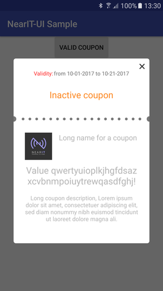
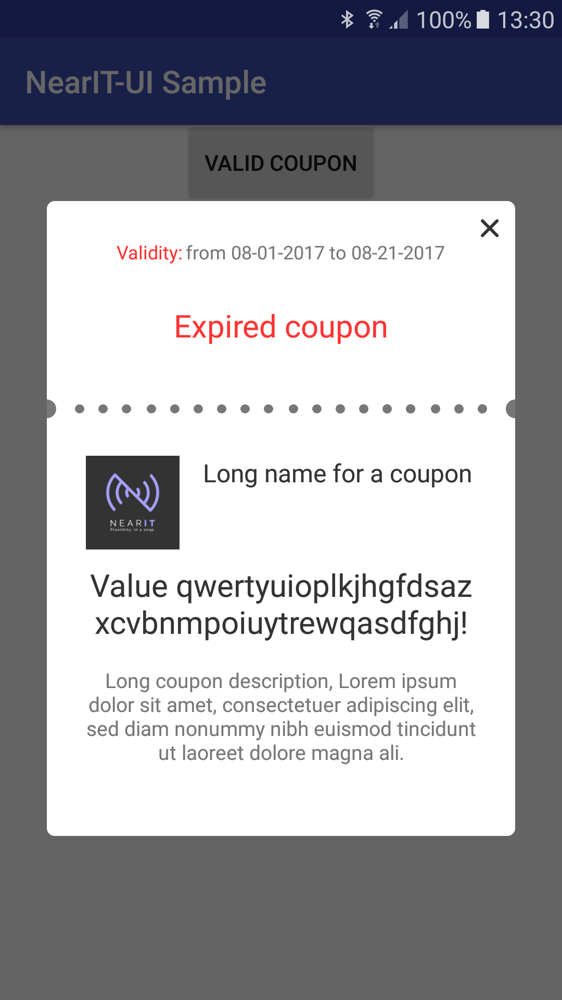
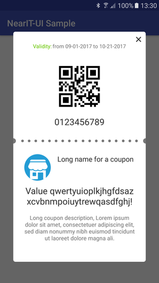

## NearIt-UI for coupon detail pop-up
#### Basic example
If you want your app to display a coupon in a beautiful pop-up dialog, use this simple code:

```java
 // ...
 startActivity(
         NearITUIBindings.getInstance(YourActivity.this)
            .createCouponDetailIntentBuilder()
            .build(coupon));
```

where, `coupon` is an instance of NearIT SDK `Coupon` class. Further information on coupons and other in-app content can be found [here](http://nearit-android.readthedocs.io/en/latest/in-app-content/).






#### Advanced examples
NearIT-UI is shipped with our brand as icon placeholder. If you need to replace it just add one line of code:

```java
  // ...
  startActivity(
          NearITUIBindings.getInstance(YourActivity.this)
             .createCouponDetailIntentBuilder()
             .setIconPlaceholderResourceId(R.drawable.your_drawable)
             .build(coupon));
```

Please, keep in mind that the icon should be a square: a different aspect-ratio can potentially break the layout.

Optionally, you can display the coupon in your custom Activity by adding a Fragment to it. You can get a Fragment via another builder:

```java
  // ...
  Fragment couponFragment = NearITUIBindings.getInstance(YourActivity.this)
        .createCouponDetailFragmentBuilder()
        //  here you can call other methods of the builder
        .build(coupon);
```

Even if our pop-up dialog is well designed, you can try to do a better job by overriding resources (see [UI Customization](##ui-customization)). As the separator is a PNG file you may want to replace it.
Methods `setSeparatorResourceId(R.drawable.your_separator_drawable)` and `setNoSeparator()` are available for both of the builders.

## UI Customization

If you wish to change some messages, the existing strings can be overridden by name in your application. For example, consider the following `res/values/strings.xml`

```xml
<resources>
    <!-- -->
    <string name="nearit_ui_coupon_expired_text">Text for an expired coupon</string>
    <string name="nearit_ui_coupon_inactive_text">Text for a not active coupon</string>
    <!-- -->
</resources>
```

these string resources will replace those that are provided by NearIT-UI library.

The same is for colors. Please have a look at this `res/values/colors.xml`

```xml
    <!-- -->
    <color name="nearit_ui_coupon_detail_coupon_name_color">@color/your_color1</color>
    <color name="nearit_ui_coupon_detail_coupon_value_color">@color/your_color2</color>
    <color name="nearit_ui_coupon_detail_coupon_description_color">@color/your_color1</color>
    <!-- -->
```

The background of the coupon is composed by two sections (and a separator), the overriding of the color resource `@color/nearit_ui_coupon_background_color` will change the tint of both (not the separator, see the last paragraph of [this](####advanced-examples)).