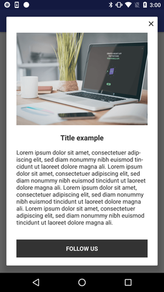

# NearIt-UI for content notification

## Basic example
If you want your app to display a NearIT content in a pop-up dialog, use this simple code:

```java
 JAVA
 // ...
 startActivity(
         NearITUIBindings.getInstance(YourActivity.this)
            .createContentDetailIntentBuilder(content)
            .build());
```

```kotlin
 KOTLIN
 // ...
 startActivity(
         NearITUIBindings.getInstance(this@YourActivity)
            .createContentDetailIntentBuilder(content)
            .build())
```

where, `content` is an instance of NearIT SDK `Content` class. Further information on contents and other in-app content can be found [here](http://nearit-android.readthedocs.io/en/latest/in-app-content/).



When the user taps on the button, the link will be opened: some types of link will be managed by a specific app, if that app is installed (e.g. a Facebook link).

Optionally, you can display the content in your custom Activity by adding a Fragment to it. You can get a Fragment via another builder:

```java
  JAVA
  // ...
  Fragment contentFragment = NearITUIBindings.getInstance(YourActivity.this)
        .createContentDetailFragmentBuilder(content)
        .build();
```

```kotlin
  KOTLIN
  // ...
  val contentFragment: Fragment = NearITUIBindings.getInstance(this@YourActivity)
        .createContentDetailFragmentBuilder(content)
        .build()
```

#### Advanced examples
If you want to enable the tap-outside-to-close functionality, add `.enableTapOutsideToClose()` call on the builder, like the following example:

Java version
```java
 // ...
 startActivity(
         NearITUIBindings.getInstance(YourActivity.this)
            .createContentDetailIntentBuilder(content)
            .enableTapOutsideToClose()
            .build());
```

Kotlin version
```kotlin
 // ...
 startActivity(
         NearITUIBindings.getInstance(this@YourActivity)
            .createContentDetailIntentBuilder(content)
            .enableTapOutsideToClose()
            .build())
```

## UI Customization
If you need to tweak the way your dialog looks, you can override some resources by name in your application.
Placing an xml file named `nearit_ui_selector_cta_button.xml` in your app `res/drawable` directory will replace the default button at the bottom of the content dialog and make it look the way you prefer. 