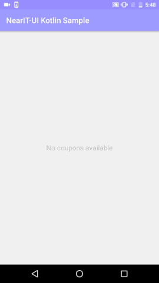

# NearIt-UI for coupon list

Providing the list of the coupons earned by the user is a common feature of the apps that integrate NearIT.
With NearIt-UI you can launch an activity or get a fragment that contains the coupons with our proposed sorting.

#### Introduction

To understand the examples in this section it is important to know how NearIT coupons work.
A coupon can have a date from which an user can redeem it and an expiration date: at a certain date a coupon could be in one of these states:
- valid: redeemable, not expired and not already used.
- not yet active: not yet redeemable
- expired: current date is beyond the expiration one
- redeemed: coupon code has been used

Please note that the list is implemented as a `RecyclerView`: this means that adds an additional dependency but lets you show a large amount of coupons and keep the UX smooth. 

#### Basic example 
With these few lines of code

```java
startActivity(NearITUIBindings.getInstance(YourActivity.this)
                        .createCouponListIntentBuilder()
                        .build()
                );
```

you are able to show the list of coupons with this sorting rationale:
- valid coupons
- not yet active coupons
- expired coupons

each set is ordered by the date the user earned the coupons.


If your app needs to show already redeemed coupons too, just add `.includeRedeemed()` call:

```java
startActivity(NearITUIBindings.getInstance(YourActivity.this)
                        .createCouponListIntentBuilder()
                        .includeRedeemed()
                        .build()
              );
```

and the coupons already used by the user will be shown at the bottom of the list, with the expired ones.

If a server or network problem occurs while the coupon list is being downloaded, an alert dialog will pop-up and the user will be able to simply close it or to retry the download, triggering a refresh of the coupon list and dismissing the dialog.
 


#### Advanced examples
In your application you may want to show only coupons that are in certain states. With our builder you can request a list of only valid coupons:

```java
startActivity(NearITUIBindings.getInstance(YourActivity.this)
                        .createCouponListIntentBuilder()
                        .getValidOnly()
                        .build()
                );
```

The same for the other states:
- `getExpiredOnly()`
- `getInactiveOnly()`
- `getRedeemedOnly()`

If you want to list the coupons in your activity, place this fragment in your container:

```java
Fragment couponListFragment = NearITUIBindings.getInstance(this)
                .createCouponListFragmentBuilder()
                .build();
```

This builder provides the same methods of the previous, so you can show the list you prefer.

Additionally, using both of the builders you are able to set the behaviour and look of the coupon detail that it is going to be shown when an user taps on one item of the list.
The settings that are available are the one that you can set via the coupon detail UI of this library:

- `setIconPlaceholderResourceId(int icon)`
- `setSeparatorResourceId(int separator)`
- `setNoSeparator()`
- `setNoIcon()`
- `enableTapOutsideToClose()`

Read more about the coupon detail UI and how to tweak it [here](COUPON.md).

## UI Customization
Like any other UI component provided by this library, you can change the look overriding colors, dimensions and strings resources.

For example, if you need to change the validity text colors, you can place these colors in your `res/values/colors.xml`:
```xml
<!--    ...     -->
<color name="nearit_ui_coupon_list_valid_text_color">@color/your_color</color>
<color name="nearit_ui_coupon_list_inactive_text_color">@color/your_color</color>
<color name="nearit_ui_coupon_list_expired_text_color">@color/your_color</color>
<color name="nearit_ui_coupon_list_redeemed_text_color">@color/your_color</color>
<!--    ...     -->
```

The same for strings and dimensions. For the complete list of resources have a look in [this directory](../nearit-ui/src/main/res/values).

Just keep in mind that changing dimensions can cause unpredictable distortion problems to our layouts.