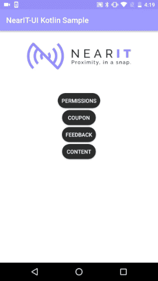
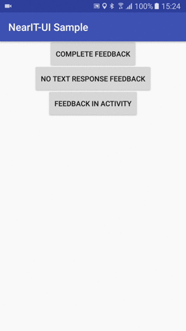
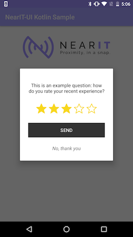

# NearIt-UI for feedback request pop-up
#### Basic example
If you want your app to display a feedback request in a beautiful pop-up dialog, use this simple code:

Java version:
```java
 // ...
 startActivity(
         NearITUIBindings.getInstance(YourActivity.this)
            .createFeedbackIntentBuilder(feedback)
            .build());
```

Kotlin version:
```kotlin
 // ...
 startActivity(
         NearITUIBindings.getInstance(this@YourActivity)
            .createFeedbackIntentBuilder(feedback)
            .build())
```

where, `feedback` is an instance of NearIT SDK `Feedback` class. Further information on coupons and other in-app content can be found [here](http://nearit-android.readthedocs.io/en/latest/in-app-content/).
The Feedback UI also takes care of delivering the user response to the SDK library and showing the proper success or failure status of the user action.




#### Advanced examples
If you need to simplify the feedback request you are able to ask the user for the 1 to 5 rating only, without any textual comment (please notice that the text response is optional in every scenerio), you can hide the text box adding one method call:

Java version:
```java
  // ...
  startActivity(
          NearITUIBindings.getInstance(YourActivity.this)
             .createFeedbackIntentBuilder(feedback)
             .withoutComment()
             .build());
```

Kotlin version:
```kotlin
  // ...
  startActivity(
          NearITUIBindings.getInstance(this@YourActivity)
             .createFeedbackIntentBuilder(feedback)
             .withoutComment()
             .build())
```




Optionally, you can display the feedback request in your custom Activity by adding a Fragment to it. You can get a Fragment via another builder:

Java version:
```java
  // ...
  Fragment feedbackFragment = NearITUIBindings.getInstance(YourActivity.this)
        .createFeedbackFragmentBuilder(feedback)
        //  here you can call other methods of the builder
        .build();
```

Kotlin version:
```kotlin
  // ...
  val feedbackFragment: Fragment = NearITUIBindings.getInstance(this@YourActivity)
        .createFeedbackFragmentBuilder(feedback)
        //  here you can call other methods of the builder
        .build()
```

If you need to tweak the way your dialog looks, you can override some resources (see [UI Customization](#ui-customization)).
To replace or to hide the success icon you can call these methods
`setSuccessIconResId(R.drawable.your_custom_drawable)` 
`setNoSuccessIcon()`
on both of the builders.

## UI Customization

If you wish to change some messages, the existing strings can be overridden by name in your application. For example, consider the following `res/values/strings.xml`

```xml
<resources>
    <!-- -->
    <string name="nearit_ui_feedback_error_message">Your error message!</string>
    <string name="nearit_ui_feedback_close_button">Close the dialog text</string>
    <string name="nearit_ui_feedback_send_success_message">Your custom success message</string>
    <!-- -->
</resources>
```

these string resources will replace those that are provided by NearIT-UI library.

The same is for colors. Please have a look at this `res/values/colors.xml`

```xml
<resources>
    <!-- -->
    <color name="nearit_ui_feedback_background_color">your_background_color</color>
    <color name="nearit_ui_feedback_comment_box_border_color">your_comment_box_border_color</color>
    <color name="nearit_ui_feedback_comment_box_background_color">your_comment_box_background_color</color>
    <!-- -->
</resources>
```

To change the rating bar look, you should override the related resources. For example, if you want to have red stars, you should place this entries in your app `res/values/colors.xml`

```xml
<resources>
    <!-- -->
    <color name="nearit_ui_rating_bar_empty_star_background_color">@color/nearit_ui_real_white</color>
    <color name="nearit_ui_rating_bar_fill_star_background_color">#f8d71c</color>
    <color name="nearit_ui_rating_bar_star_border_color">#f8d71c</color>
    <!-- -->
</resources>
```

The confirmation button can be replaced by a custom one that match the style of your application. A custom `nearit_ui_selector_feedback_button.xml` should be something like this:

```xml
<selector xmlns:android="http://schemas.android.com/apk/res/android">
    <item android:state_activated="true" android:state_pressed="true" android:drawable="@drawable/your_error_button_when_pressed" />
    <item android:state_pressed="true" android:drawable="@drawable/your_default_button_when_is_pressed" />
    <item android:state_activated="true" android:drawable="@drawable/your_error_button" />
    <item android:drawable="@drawable/your_default_button" />
</selector>
```