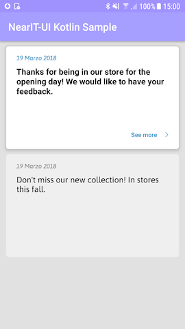

# NearIt-UI for notification inbox

Showing the history of the user notifications and content, is a common feature of apps integrated with NearIT.
With NearIt-UI you can launch an activity or get a fragment that automatically fetches and displays notifications and content ordered by received date.

## Basic example
With these few lines of code

```java
JAVA
startActivity(NearITUIBindings.getInstance(this)
                .createInboxListIntentBuilder()
                .build());
```

```kotlin
KOTLIN
startActivity(NearITUIBindings.getInstance(this@YourActivity)
                .createInboxListIntentBuilder()
                .build())
```

you can show the user notification history with our proposed filter:
- no coupons (see [the coupon list section](COUPON_LIST.md))
- no custom jsons

The included content is simple notifications, content with attachments and feedback requests. They will be ordered chronologically, so the most recent notifications will be at the top.



## Advanced examples

### No feedbacks

If you want to exclude feedbacks from the inbox list, just add `noFeedbacks()` to the intent builder

```java
JAVA
startActivity(NearITUIBindings.getInstance(this)
                .createInboxListIntentBuilder()
                .noFeedbacks()
                .build());
```

```kotlin
KOTLIN
startActivity(NearITUIBindings.getInstance(this@InboxActivity)
                .createInboxListIntentBuilder()
                .noFeedbacks()
                .build())
```

### Fragment mode

If you want to list the inbox in your activity, place this fragment in your container:

```java
JAVA
Fragment inboxFragment = NearITUIBindings.getInstance(this)
                .createInboxListFragmentBuilder()
                .build();
```

```kotlin
KOTLIN
val inboxFragment = NearITUIBindings.getInstance(this)
                .createInboxListFragmentBuilder()
                .build()
```

This builder provides the same methods of the previous, so you can show the list you prefer.