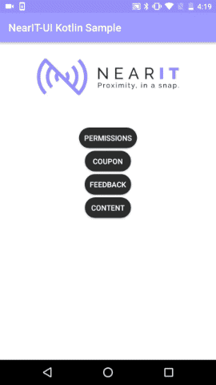

# Handle in-app content

## Heads-up notifications for foreground content
NearIt-UI can be set to manage and show notifications for foreground content (read more [here](http://nearit-android.readthedocs.io/en/latest/in-app-content/))
for you. Foreground content will be delivered through an heads-up system notification. If the user clicks on it, the right dialog will appear and the right tracking events will be handled.

**Note**: the heads-up notification overlay is only available for API level 21+. On older devices the notification will still appear, but with no overlay.



To enable this behaviour you have to add one line of code.
You **MUST** add this in the `onCreate()` method of your `Application`

```java
JAVA
public class YourApplication extends Application {

    @Override
    public void onCreate() {
        super.onCreate();
        NearITUIBindings.enableAutomaticForegroundNotifications(this);
        //  ...
    }
}
```

```kotlin
KOTLIN
class NearItUISample : Application() {

    override fun onCreate() {
        super.onCreate()
        NearITUIBindings.enableAutomaticForegroundNotifications(this)
        //  ...
    }

}
```

Please note that foreground notifications will auto-dismiss after a small amount of time.

## Background notifications
The easiest way to handle NearIT contents in your app that already integrates NearIT SDK is to edit the `onNewIntent` method of your _launcher activity_:

```java
JAVA
@Override
protected void onNewIntent(Intent intent) {
    super.onNewIntent(intent);
    //  ...
    NearITUIBindings.onNewIntent(this, intent);
    //  ...
}
```

```kotlin
KOTLIN
override fun onNewIntent(intent: Intent) {
    super.onNewIntent(intent)
    //  ...
    NearITUIBindings.onNewIntent(this, intent)
    //  ...
}
```

Or you can even go further..

NearIT-SDK has a built-in service that will handle every background event and show simple notifications, tapping on those notification will deliver an Intent to your app launcher.
If you prefer to let the NearIt-UI library handle the tap and immediately show the convenient UIs when a notification is tapped, you have to add the `NearItUIIntentService` to the manifest of your application.

You can simply copy the following code and paste it in the `<application>` scope of the manifest.

```xml
<service
    android:name="com.nearit.ui_bindings.notifications.NearItUIIntentService"
    android:exported="false"
    android:permission="android.permission.BIND_JOB_SERVICE">
    <intent-filter>
        <action android:name="it.near.sdk.permission.PUSH_MESSAGE" />
        <category android:name="android.intent.category.DEFAULT" />
    </intent-filter>
    <intent-filter>
        <action android:name="it.near.sdk.permission.GEO_MESSAGE" />
        <category android:name="android.intent.category.DEFAULT" />
    </intent-filter>
</service>
```

When your app is in background (e.g. an user closed it and maybe killed it) your user will receive a simple notification. When the notification is tapped, the app is launched and the content dialog appears.
Additionally, when your app is in foreground, background events are notified in heads-up style.
