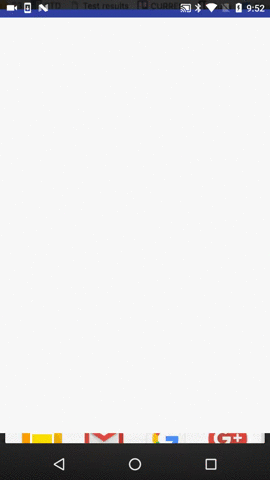

# NearIt-UI for notifications
### Heads-up notifications for in-app content
NearIt-UI can manage and show in-app content (read more about background and foreground notifications[here](http://nearit-android.readthedocs.io/en/latest/in-app-content/))
for you. When a user enters in a specific beacon range, an heads-up notification (on devices with Android API level 21+) will show. If the user clicks on it, the right dialog will appear and the right tracking events will be handled.



To enable this behaviour you have to add one line of code.
You **MUST** add this in the `onCreate()` method of your `Application`

```java
public class YourApplication extends Application {

    @Override
    public void onCreate() {
        super.onCreate();
        NearITUIBindings.enableAutomaticForegroundNotifications(this);
        //  ...
    }
}
```

Please note that foreground notifications will auto-dismiss after a small amount of time.

### Background notifications

NearIT-SDK has a built-in service that will handle every background event and show simple notifications.
If you want to directly show contents with the convenient UIs when a notification is tapped, you have to add the `NearItUIIntentService` to the manifest of your application.

You can simply copy the following code and paste it in the `<application>` scope of the manifest.

```xml
<service
    android:name="com.nearit.ui_bindings.notifications.NearItUIIntentService"
    android:exported="false"
    android:permission="android.permission.BIND_JOB_SERVICE">
    <intent-filter>
        <action android:name="it.near.sdk.permission.PUSH_MESSAGE" />
        <category android:name="android.intent.category.DEFAULT" />
    </intent-filter>
    <intent-filter>
        <action android:name="it.near.sdk.permission.GEO_MESSAGE" />
        <category android:name="android.intent.category.DEFAULT" />
    </intent-filter>
</service>
```

If your app is in background (e.g. an user closed it and maybe killed it) your user will receive a simple notification. When the notification is tapped, the app is launched and the content dialog appears.
When your app is in foreground, background events are notified in heads-up style.