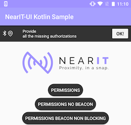
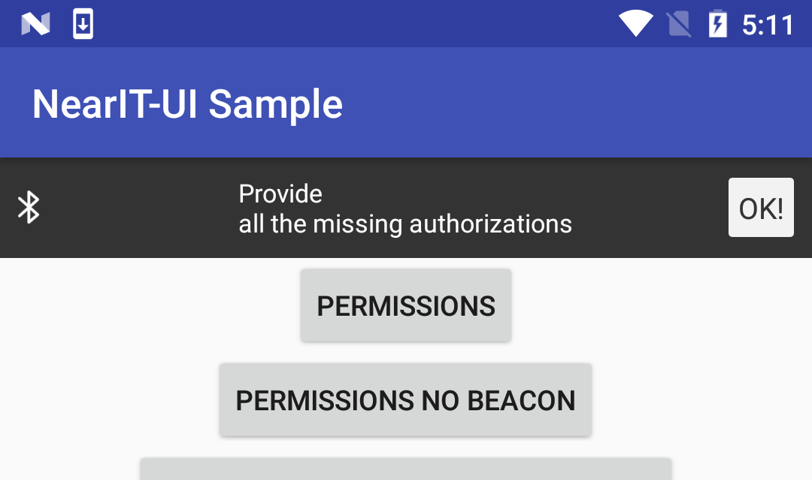
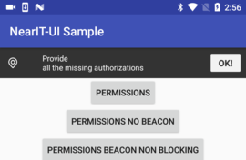
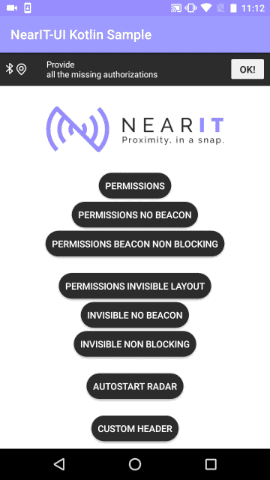

# NearIt-UI for missing permissions alert

Your app should ask the user to grant location permission and to turn the bluetooth on (if your use case implies beacons).

If you want to show a persistent bar that alert the user if any permission is missing, this library provides a convenient `View`.
This bar visually specifies what is missing (by showing/hiding the two icons) and will automatically hide itself when every permission has been granted.





Add the following xml element where you want to show the bar

```xml
<com.nearit.ui_bindings.permissions.views.PermissionBar
        android:id="@+id/permission_bar"
        android:layout_width="wrap_content"
        android:layout_height="wrap_content" />
```

and keep a reference in your activity

Java version:
```java
PermissionBar bar = (PermissionBar) findViewById(R.id.permission_bar);
```

Kotlin version: if you use the [Kotlin Android Extensions plugin](https://kotlinlang.org/docs/tutorials/android-plugin.html), you do not need to keep a reference. 

It is **important** that you pass an Activity reference to the bar: by doing this, clicking the bar button will cause the launch of the permissions request flow.



To set the activity use the following method in your activity `onCreate`:

Java version:
```java
bar.bindToActivity(YourActivity.this, NEAR_PERMISSION_REQUEST);
```

Kotlin version:
```kotlin
//  permission_bar is the id of the PermissionBar view you have placed in your layout
permission_bar.bindToActivity(this@YourActivity, NEAR_PERMISSION_REQUEST);
```

where `NEAR_PERMISSION_REQUEST` is an int value defined by you that will identify the request made by the view.
Then in your activity you should catch the `result` by referring to the same request code, this way:

Java version:
```java
@Override
protected void onActivityResult(int requestCode, int resultCode, Intent data) {
    if (requestCode == YOUR_REQUEST_CODE) {
        if (resultCode == Activity.RESULT_OK) {
            //  all the necessary prerequirements are ok, in the most common scenarios you should start NearIT radar here
            NearItManager.getInstance().startRadar();
        } else {
            //  some permission is still missing
        }
    }
}
```

Kotlin version:
```kotlin
override fun onActivityResult(requestCode: Int, resultCode: Int, data: Intent?) {
        if (requestCode == NEAR_PERMISSION_REQUEST) {
            if (resultCode == Activity.RESULT_OK) {
                //  all the necessary prerequirements are ok, in the most common scenarios you should start NearIT radar here
                NearItManager.getInstance().startRadar()
            } else {
                //  some permission is still missing
            }
        }
    }
```

To unbind the activity call the following method in your activity `onDestroy`

Java version:
```java
bar.unbindFromActivity();
```

Kotlin version:
```kotlin
//  permission_bar is the id of the PermissionBar view you have placed in your layout
permission_bar.unbindFromActivity()
```

Because the permissions request flow launched by the `OK!` button is the same provided [here](PERMISSIONS.md), you can customize its behaviour and look.
When you add the xml element you can set some attributes:

```xml
<com.nearit.ui_bindings.permissions.views.PermissionBar
        android:id="@+id/permission_bar"
        android:layout_width="wrap_content"
        android:layout_height="wrap_content"
        
        app:noBeacon="true"
        app:invisibleMode="false"
        app:dialogHeader="@drawable/your_drawable"
        />
```

**Note**: the default flow is in a no-UI style (just a cascade of system dialogs)
Please read the permission UI [section](PERMISSIONS.md) of these docs to have a complete view on what you can do with the permissions request.

## UI customization

If you want to change the alert message, add the following attribute to the `PermissionBar` element of your layout:

```xml
<com.nearit.ui_bindings.permissions.views.PermissionBar
        android:id="@+id/permission_bar"
        android:layout_width="wrap_content"
        android:layout_height="wrap_content"
        
        app:barAlertText="Your custom alert message"
        
        />
```

The other UI customizations available from xml attributes are:

```xml
<com.nearit.ui_bindings.permissions.views.PermissionBar
        android:id="@+id/permission_bar"
        android:layout_width="wrap_content"
        android:layout_height="wrap_content"
        
        app:barBluetoothIcon="@drawable/your_drawable_bt_icon"
        app:barLocationIcon="@drawable/your_drawable_loc_icon"
        
        />
```

and let you change the bluetooth and location icons.

As usual, you can override our string/color/dimen resources by name. Just as a short example, you can change the bar colors this way:
```xml
<!--  This is the res/values/colors.xml file of your app
       ...     -->
<color name="nearit_ui_permission_bar_background_color">your_color</color>
<color name="nearit_ui_permission_bar_alert_text_color">your_color</color>
<color name="nearit_ui_permission_bar_button_background_color">your_color</color>
<!--    ...     -->
```
